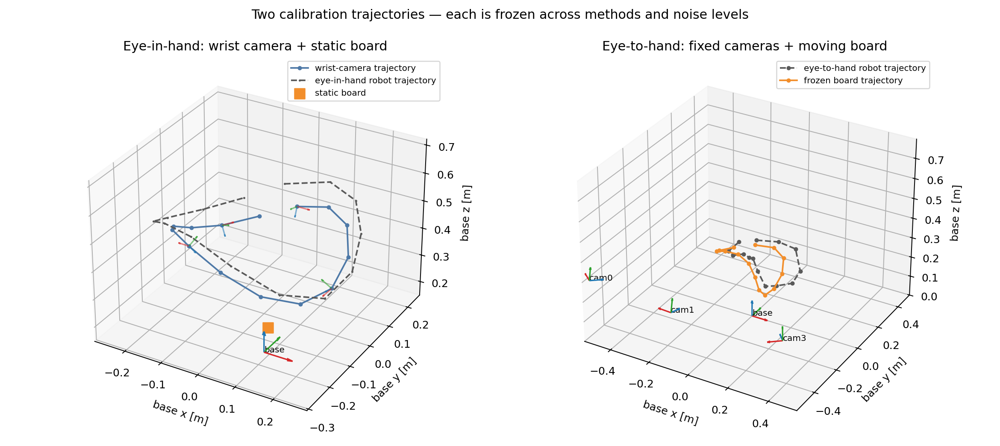
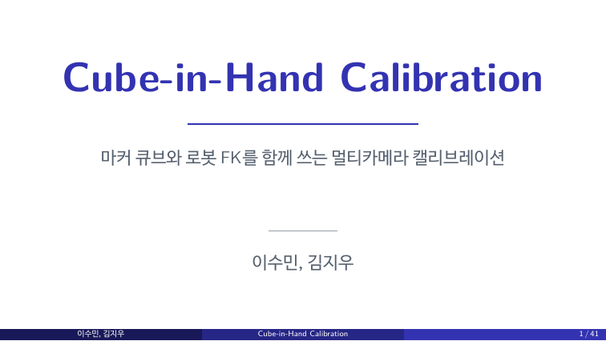
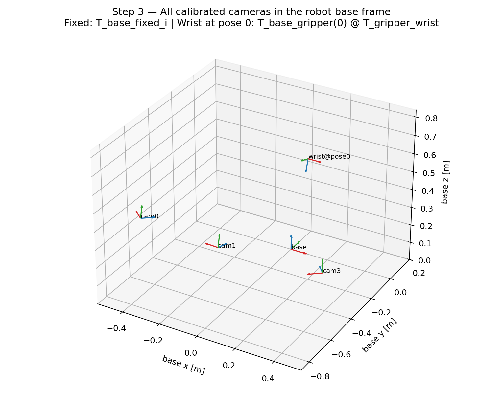
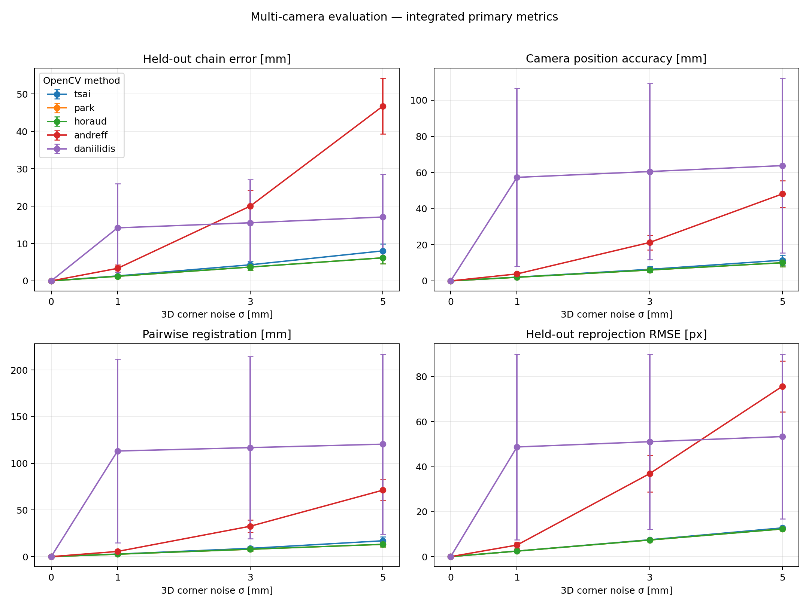
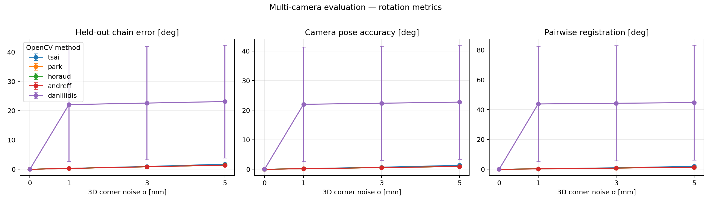

# Multi-camera–robot calibration simulation benchmark

실제 로봇 데이터에 calibration 알고리즘을 적용하기 전에 구현과 평가 절차를 검증하기 위한 reference benchmark 임.

## 배경
- Eye-in-hand wrist camera 1대
- Eye-to-hand fixed camera 3대
- Board 기반 OpenCV hand–eye calibration
- 고정된 calibration/held-out split
- `0, 1, 3, 5 mm` 3D corner perception noise
- Camera별 결과와 multi-camera 통합 결과 출력

> 해당 예시는 OpenCV single-camera solver를 wrist와 fixed camera에 각각 적용한 classical baseline이다.



## 연구 배경 발표자료

아래 자료는 benchmark 실행법이 아니라, 연구 본체인 Cube-in-Hand calibration의 문제 설정과
No-FK/Fixed-FK formulation을 설명함.
연구 주제를 사전에 파악한 뒤 실험을 돌려보는 것을 추천!!
[](docs/presentation/Cube-in-Hand_Calibration.pdf?raw=1)

- [발표자료 PDF 열기/다운로드 — 42 pages](docs/presentation/Cube-in-Hand_Calibration.pdf?raw=1)
- 발표자료의 Cube/FK joint method와 이 저장소의 OpenCV independent baseline을 구분해서 읽음

## 1. 이 코드로 확인하는 것

- 좌표계 방향과 transform chain이 맞는가
- Eye-in-hand와 eye-to-hand 입력 변환이 맞는가
- 무잡음에서 ground truth를 복원하는가
- 비교 알고리즘에 동일한 trajectory와 observation을 전달하는가
- Noise가 증가할 때 held-out 성능이 어떻게 변하는가
- 개별 camera 오차가 전체 camera registration에 어떻게 전달되는가
- Calibration에 사용하지 않은 frame에서도 reprojection이 유지되는가

## 2. 좌표계 표기

모든 변환은 `T_destination_source`로 표기한다.

```text
T_base_gripper       gripper frame → robot base frame
T_gripper_wrist      wrist camera frame → gripper frame
T_base_fixed_i       fixed camera i frame → robot base frame
T_camera_board       board frame → camera frame
```

Eye-in-hand:

```text
T_base_board
  = T_base_gripper(k)
  @ T_gripper_wrist
  @ T_wrist_board(k)
```

Eye-to-hand:

```text
T_base_board(k)
  = T_base_fixed_i
  @ T_fixed_i_board(k)
```

Wrist camera를 특정 robot pose의 base frame에 놓을 때:

```text
T_base_wrist(k)
  = T_base_gripper(k)
  @ T_gripper_wrist
```



이 그림에는 calibration 결과인 robot base와 네 camera frame만 표시한다. 별도의 workspace
중심점이나 camera 시선은 calibration 변수가 아니므로 표시하지 않는다.

## 3. 폴더 구조

```text
.
├── README.md
├── intrinsics/
│   ├── cam0.npz
│   ├── cam1.npz
│   ├── cam2.npz              # wrist camera
│   └── cam3.npz
├── SOTA_Simulation/
│   ├── environment.yml
│   ├── config.example.json
│   ├── tsai_combined_demo.py
│   ├── tsai_noise_sweep.py
│   ├── opencv_multicam_evaluation.py
│   └── ...
├── docs/images/
├── docs/presentation/
│   └── Cube-in-Hand_Calibration.pdf
├── examples/
│   └── opencv_multicam_metrics_report.json
└── tests/
    └── test_smoke.py
```

## 4. 설치

저장소 root에서 실행한다.

```bash
conda env create -f SOTA_Simulation/environment.yml
conda activate sota-calibration-sim
```

이미 환경이 있다면:

```bash
conda env update -n sota-calibration-sim \
  -f SOTA_Simulation/environment.yml --prune
```

## 5. 가장 먼저 실행할 예제

Tsai–Lenz의 전체 transform 흐름을 확인한다.

```bash
bash SOTA_Simulation/launch_tsai_demo.sh
```

출력 단계:

1. 정지 board를 이용한 eye-in-hand calibration
2. 움직이는 board를 이용한 camera별 eye-to-hand calibration
3. 추정된 wrist와 fixed camera만 robot base frame에 배치
4. 무잡음 GT error 확인

이 예제는 좌표계 확인용이다. 논문 결과는 다음 held-out evaluation으로 생성한다.

## 6. OpenCV 비교 방법

동일한 `cv2.calibrateHandEye()` 입력에 method flag만 변경한다.

| 이름 | OpenCV flag | 방식 |
| --- | --- | --- |
| Tsai–Lenz | `CALIB_HAND_EYE_TSAI` | Rotation/translation separable |
| Park–Martin | `CALIB_HAND_EYE_PARK` | Lie-group 기반 separable |
| Horaud–Dornaika | `CALIB_HAND_EYE_HORAUD` | Quaternion 기반 separable |
| Andreff et al. | `CALIB_HAND_EYE_ANDREFF` | Simultaneous |
| Daniilidis | `CALIB_HAND_EYE_DANIILIDIS` | Dual quaternion simultaneous |

구현은 OpenCV의 공개
[`calibration_handeye.cpp`](https://github.com/opencv/opencv/blob/4.x/modules/calib3d/src/calibration_handeye.cpp)를 사용한다.

모든 방법을 한 번에 실행:

```bash
python SOTA_Simulation/tsai_noise_sweep.py \
  --methods all \
  --noise-mm 0 1 3 5 \
  --trials 30
```

특정 방법만 실행:

```bash
python SOTA_Simulation/tsai_noise_sweep.py \
  --methods tsai park horaud \
  --noise-mm 0 1 3 5 \
  --trials 30
```

방법별 script를 복사하지 않는다. 하나의 runner를 사용해야 모든 방법이 동일한 trajectory,
noise sample과 random seed를 공유한다.

### 6.1 다음에 적용할 robot-world/hand-eye baseline

다음 두 방법만 우선 적용한다. **두 방법을 동시에 진행하지 않고, Shah를 끝낸 뒤
Tabb & Ahmad Yousef로 넘어가는 것을 추천함!!** 아직 adapter가 구현되지 않았으므로 현재 README의 예시
결과에는 두 방법이 포함되어 있지 않다.

#### 1단계 — Shah (2013)

- 방법: Kronecker product를 이용한 closed-form robot-world/hand-eye calibration
- 논문: [M. Shah, *Solving the Robot-World/Hand-Eye Calibration Problem Using the Kronecker Product*](https://www.nist.gov/publications/solving-robot-worldhand-eye-calibration-problem-using-kronecker-product)
- DOI: [10.1115/1.4024473](https://doi.org/10.1115/1.4024473)
- 구현: OpenCV [`calibrateRobotWorldHandEye`](https://docs.opencv.org/4.x/d9/d0c/group__calib3d.html)와
  [`CALIB_ROBOT_WORLD_HAND_EYE_SHAH`](https://github.com/opencv/opencv/blob/4.x/modules/calib3d/src/calibration_handeye.cpp)
- 작업 순서
  1. 현재 simulation transform을 OpenCV 입력 방향으로 변환하는 adapter 작성
  2. 무잡음 데이터에서 ground truth 복원 및 transform 방향 확인
  3. 기존 calibration/held-out split과 동일한 `0, 1, 3, 5 mm` noise sweep 실행
  4. camera별 결과와 8장의 네 가지 통합 지표 출력
- 완료 조건: 무잡음 검증을 통과하고, 기존 방법과 동일한 trajectory·noise·평가 코드로
  결과가 저장되어야 한다.

#### 2단계 — Tabb & Ahmad Yousef (2017)

- 방법: iterative robot-world/hand-eye(s) calibration; multi-eye 설정과 여러 cost/rotation
  parameterization을 제공
- 논문: [A. Tabb and K. M. Ahmad Yousef, *Solving the Robot-World Hand-Eye(s) Calibration Problem with Iterative Methods*](https://doi.org/10.1007/s00138-017-0841-7)
- 공개 논문: [arXiv](https://arxiv.org/abs/1907.12425)
- 저자 구현: [`amy-tabb/RWHEC-Tabb-AhmadYousef`](https://github.com/amy-tabb/RWHEC-Tabb-AhmadYousef)
- 작업 순서
  1. 저자 저장소의 제공 예제를 먼저 빌드하고 재현
  2. 사용할 cost function과 rotation parameterization을 논문 근거와 함께 하나로 고정
  3. `SOTA_Simulation/adapter_template.py` 형식으로 입력 생성과 결과 변환 구현
  4. 무잡음(노이즈 0) 검증 후 Shah와 동일한 noise sweep 및 통합 평가 실행


#### 두 단계의 공통 원칙

- 기존 robot trajectory, held-out event, random seed와 noise sample을 변경하지 않는다.
- 외부 방법의 transform convention은 adapter 안에서만 변환한다.
- 관측에 오차가 전혀 없는 가장 쉬운 조건에서도 정답을 찾지 못한다면 noise 실험으로 넘어가지 말고, 먼저 좌표계 방향과 입력 변환 코드를 점검한다.
- 논문에 없는 refinement를 추가할 경우 원 방법과 구분되는 별도 variant로 기록한다.

## 7. 논문 결과용 held-out evaluation

```bash
python SOTA_Simulation/opencv_multicam_evaluation.py \
  --methods all \
  --noise-mm 0 1 3 5 \
  --trials 30
```

기본 split:

```text
전체 pose       14개
Calibration     10개
Held-out         4개: event 2, 5, 9, 12
```

Held-out event는 `calibrateHandEye()`에 전달하지 않는다.

### 7.1 Noise 정의

- Camera frame에서 관측된 각 board corner의 x/y/z 좌표에 Gaussian noise 적용
- `1 mm`는 각 coordinate에 적용한 noise의 standard deviation
- Noisy 3D corner에 rigid board pose를 fitting
- 재추정된 `T_camera_board`에는 translation과 rotation error가 함께 발생
- 같은 trial에서는 하나의 standard-normal sample을 `1, 3, 5`배 scaling
- 모든 알고리즘이 완전히 같은 noisy observation 사용

이 noise는 3D corner detector를 가정한 stress test이다. RGB ChArUco의 pixel detector noise와
동일한 뜻이 아니다.

## 8. 반드시 출력할 네 가지 통합 지표

Translation, rotation과 pixel error는 서로 다른 물리량이다. 임의 가중합으로 하나의 score를
만들지 않고 각각 보고한다.

### 8.1 Held-out chain error

- Calibration에 사용하지 않은 board observation 사용
- 추정 camera extrinsic으로 board를 robot base frame으로 변환
- Ground-truth board pose와 비교
- 출력: translation error `[mm]`, rotation error `[degree]`
- Wrist와 fixed camera, 모든 held-out pose를 통합 평균

### 8.2 Camera pose accuracy

- Wrist, cam0, cam1, cam3의 추정 extrinsic을 GT와 비교
- Wrist는 held-out reference robot pose에서 base frame으로 변환한 뒤 비교
- 출력: equal-camera macro translation `[mm]`, rotation `[degree]`
- Camera별 결과는 원시 CSV에서 별도로 확인

### 8.3 Multi-camera registration consistency

네 카메라에서 만들 수 있는 camera pair는 여섯 개이다.

```text
wrist–cam0, wrist–cam1, wrist–cam3,
cam0–cam1, cam0–cam3, cam1–cam3
```

- 각 pair의 relative transform을 추정값과 GT에서 각각 계산
- 여섯 relative-transform error를 평균
- 출력: pairwise translation `[mm]`, rotation `[degree]`

이 값은 카메라들이 공통 base frame에 얼마나 일관되게 등록됐는지 보여준다.

### 8.4 Held-out reprojection RMSE

- Calibration에 사용하지 않은 pose만 사용
- Robot pose와 추정 extrinsic으로 board corner pixel을 예측
- Noisy held-out observation과 비교
- Wrist는 `intrinsics/cam2.npz` 사용
- Fixed camera는 각 camera의 실제 NPZ 사용
- 모든 held-out camera/corner의 pixel squared error를 모아 RMSE 계산

Reprojection error가 작다고 camera extrinsic이 반드시 정확한 것은 아니다. Camera pose accuracy와
registration consistency를 함께 확인한다.

## 9. 예시 결과

실험 조건:

- OpenCV 5개 방법
- Camera 4대
- Noise `0, 1, 3, 5 mm`
- 조건별 30 trials
- 동일 trajectory와 paired noise

무잡음에서는 모든 방법과 모든 지표가 numerical tolerance 안에서 0을 복원했다.

### 1 mm noise

| 방법 | Held-out | Camera pose | Registration | Reprojection |
| --- | ---: | ---: | ---: | ---: |
| Tsai | 1.34 mm | 2.08 mm | 2.76 mm | 2.48 px |
| Park | **1.24 mm** | **2.01 mm** | **2.63 mm** | **2.46 px** |
| Horaud | **1.24 mm** | 2.01 mm | 2.64 mm | **2.46 px** |
| Andreff | 3.35 mm | 3.86 mm | 5.56 mm | 5.14 px |
| Daniilidis | 14.20 mm | 57.30 mm | 113.19 mm | 48.76 px |

### 3 mm noise

| 방법 | Held-out | Camera pose | Registration | Reprojection |
| --- | ---: | ---: | ---: | ---: |
| Tsai | 4.31 mm | 6.40 mm | 8.87 mm | 7.51 px |
| Park | 3.71 mm | **6.03 mm** | **7.91 mm** | 7.39 px |
| Horaud | **3.71 mm** | 6.03 mm | 7.92 mm | **7.39 px** |
| Andreff | 20.00 mm | 21.27 mm | 32.56 mm | 36.89 px |
| Daniilidis | 15.56 mm | 60.53 mm | 116.83 mm | 51.10 px |

### 5 mm noise

| 방법 | Held-out | Camera pose | Registration | Reprojection |
| --- | ---: | ---: | ---: | ---: |
| Tsai | 8.04 mm | 11.46 mm | 16.98 mm | 12.78 px |
| Park | 6.18 mm | **10.05 mm** | **13.19 mm** | 12.31 px |
| Horaud | **6.18 mm** | 10.05 mm | 13.20 mm | **12.30 px** |
| Andreff | 46.77 mm | 48.12 mm | 71.23 mm | 75.71 px |
| Daniilidis | 17.10 mm | 63.80 mm | 120.51 mm | 53.38 px |



Rotation 결과:



### 결과 해석

- 현재 synthetic trajectory에서는 Park와 Horaud가 거의 동일하게 가장 안정적
- Tsai는 Park/Horaud보다 다소 큰 error
- Andreff는 noise가 증가할 때 translation과 reprojection이 빠르게 악화
- Daniilidis는 현재 wrist trajectory에서 불안정하여 전체 registration도 크게 악화
- 이 순위는 현재 trajectory와 3D-corner noise model에 대한 결과
- 실제 데이터에서도 같은 순위라고 가정하지 않음

## 10. 생성되는 결과 파일

```text
SOTA_Simulation/outputs/opencv_multicam_metrics/
├── report.json
├── records.csv
├── figure1_integrated_metrics.png
└── figure2_rotation_metrics.png
```

- `report.json`: split, metric 정의, method/noise별 mean과 standard deviation
- `records.csv`: method/noise/trial별 모든 통합 지표
- Figure 1: held-out, camera pose, registration, reprojection
- Figure 2: held-out, camera pose, registration의 rotation error

재현된 예시 report는 [`examples/opencv_multicam_metrics_report.json`](examples/opencv_multicam_metrics_report.json)에
포함되어 있다.

Park–Martin 단독 30-trial 재현 결과와 실제 데이터 적용 요건은
[`docs/park_calibration_evaluation.md`](docs/park_calibration_evaluation.md)에 정리했다. 원시 CSV,
JSON과 그래프는 [`examples/park_multicam_metrics/`](examples/park_multicam_metrics/)에 있다.

## 11. 새로운 SOTA 방법을 붙일 때

1. 기존 trajectory와 held-out split을 변경하지 않는다.
2. 기존 noise sample과 seed를 그대로 사용한다.
3. 단위를 metre와 degree로 명확히 변환한다.
4. `T_destination_source` convention은 공통 코드 안에서 변경하지 않는다.
5. 외부 방법의 convention 차이는 adapter 안에서만 처리한다.
6. 원 방법에 없는 refinement를 추가하면 별도 variant로 보고한다.
7. 실패 trial을 삭제하지 않고 failure로 기록한다.
8. 네 primary metric과 rotation 보조 metric을 모두 보고한다.
9. Camera별 결과와 system-level 결과를 함께 보관한다.
10. 공개 코드 commit hash와 dependency version을 기록한다.

기본 adapter 형식은 [`SOTA_Simulation/adapter_template.py`](SOTA_Simulation/adapter_template.py)를
참고한다.

## 12. 현실성과 한계

현실과 유사한 부분:

- 실제 board geometry
- 실측 camera intrinsic과 distortion
- Eye-in-hand/eye-to-hand transform chain
- Calibration과 held-out data 분리
- 여러 camera의 base-frame registration
- Observation noise가 translation과 rotation calibration에 함께 전달

아직 포함하지 않은 부분:

- RGB image rendering 및 실제 ChArUco detection
- `2D corner detection → PnP → T_camera_board` 전체 경로
- Motion blur, occlusion, corner dropout 및 outlier
- Board 휨, 인쇄 크기 오차와 marker localization bias
- Intrinsic calibration uncertainty
- Robot FK absolute error, backlash와 thermal drift
- Camera/robot timestamp synchronization error
- View angle과 depth에 따른 heteroscedastic noise

따라서 이 저장소의 용도는 다음과 같다.

- 적용한 알고리즘 검증, 좌표계 검증, adapter 검증, classical baseline, 평가 프로토콜 예제
- 실제 RGB 성능의 절대적 예측 X , 최종 논문 수치의 단독 근거 X (실제 데이터로 진행 필요)

## 13. 실제 데이터 적용 전 체크리스트

- [ ] 무잡음에서 모든 transform error가 tolerance 이내인가
- [ ] Calibration/held-out frame이 완전히 분리됐는가
- [ ] 모든 방법에 동일한 robot trajectory를 사용했는가
- [ ] 모든 방법에 동일한 noisy observation을 사용했는가
- [ ] Wrist와 fixed camera의 transform 방향을 각각 확인했는가
- [ ] Camera별 결과와 통합 결과를 모두 저장했는가
- [ ] Pairwise registration 여섯 쌍을 모두 평가했는가
- [ ] Reprojection을 held-out frame에서 계산했는가
- [ ] Failure trial과 NaN을 숨기지 않았는가
- [ ] 실제 noise 분포를 별도로 측정했는가
