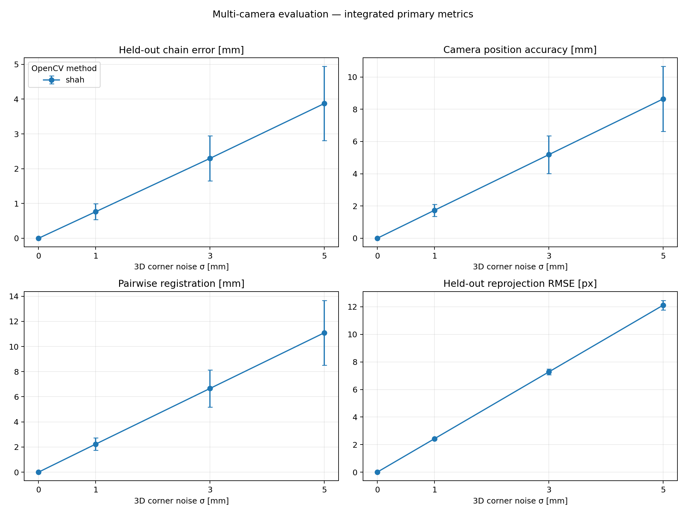
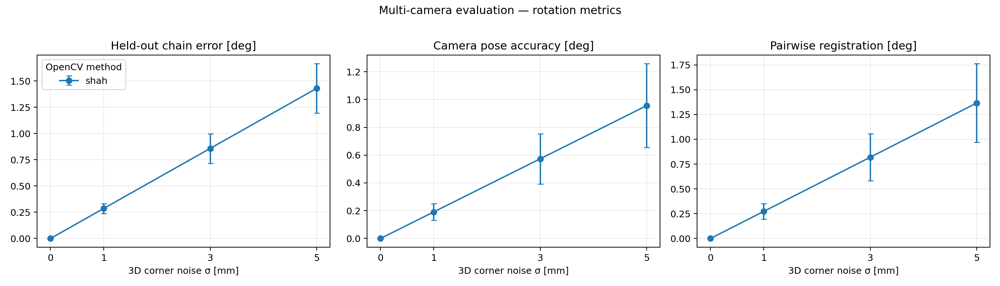

# Shah Robot-World/Hand-Eye Calibration 시뮬레이션 평가

## 1. 작업 범위

이 문서는 OpenCV의 `calibrateRobotWorldHandEye`를 사용하는 Shah(2013) Kronecker product 방법을 공통 simulation/evaluation protocol에서 단독 실행하고 transform 방향, 무잡음 복원, noise 민감도와 held-out 성능을 확인한 결과다.

기존 5개 방법(Tsai/Park/Horaud/Andreff/Daniilidis)이 `cv2.calibrateHandEye()`(AX=XB)를 쓰는 것과 달리, Shah는 `cv2.calibrateRobotWorldHandEye()`(AX=YB)를 사용하므로 solver 연결 경로가 다르다. 이를 위해 `SOTA_Simulation/shah_solver.py`를 새로 추가하고 `opencv_multicam_evaluation.py`에 method dispatch 분기를 추가했다. 공통 trajectory, split, noise sample, seed, 평가 코드는 변경하지 않았다.

- 실행 방법: `shah` (`cv2.CALIB_ROBOT_WORLD_HAND_EYE_SHAH`)
- OpenCV: 4.13.0
- Python: 3.10.21
- 실행일: 2026-08-24
- 실행 브랜치: `6-implement-shah-2013-calibration`

## 2. Shah 방법 요약

Shah(2013)는 hand–eye calibration의 고전적 `AX = XB` 관계가 아니라 **robot-world/hand-eye 관계 `AjX = YBj`** 를 푼다. 미지수가 X 하나가 아니라 X, Y **두 개**라는 점이 핵심이다.

기존 5개 방법은 연속된 두 포즈 사이의 **상대 운동**으로 A, B를 정의하여 `cv2.calibrateHandEye()`로 미지수 하나를 추정하지만, Shah는 각 포즈에서의 **절대 관측치**(로봇 base→gripper, camera→board)를 그대로 사용해 X, Y를 동시에, 그러나 **분리된(separable) 방식**으로 구한다: 먼저 `vec(AXB) = (Bᵀ⊗A)vec(X)` 항등식으로 회전 성분을 Kronecker product 기반 선형 시스템으로 만들고, 그 계수 행렬 `K = Σ(R_Bj ⊗ R_Aj)`의 SVD에서 최대 특이값에 대응하는 좌/우 특이벡터로 R_X, R_Y를 구한 뒤(det=1 스케일링 + 재직교화), 이어서 이동 성분을 선형 최소자승으로 푼다.

본 benchmark는 별도의 보정이나 refinement 없이 OpenCV `calibrateRobotWorldHandEye()` 구현을 그대로 사용하되, **OpenCV가 반환하는 값이 논문 식 `AjX=YBj`를 만족하는 X, Y의 역행렬**이라는 점을 synthetic zero-noise 테스트로 직접 확인하여 `SOTA_Simulation/shah_solver.py` 내부에서 보정했다 (아래 3절 참고).

참고:

- [Shah, *Solving the Robot-World/Hand-Eye Calibration Problem Using the Kronecker Product*, J. Mechanisms and Robotics, 2013](https://doi.org/10.1115/1.4024473)
- [OpenCV `calibrateRobotWorldHandEye()` 문서](https://docs.opencv.org/4.x/d9/d0c/group__calib3d.html)
- [OpenCV `calibration_handeye.cpp` 소스](https://github.com/opencv/opencv/blob/4.x/modules/calib3d/src/calibration_handeye.cpp)

## 3. 입력·출력과 transform convention

저장소의 변환은 source frame 좌표를 destination frame으로 옮기는 `T_destination_source` 4×4 homogeneous transform으로 표기한다. Shah는 **미지수가 2개**이므로, 다른 방법과 직접 비교 가능한 "주 출력"과, 보드(또는 gripper) 고정 위치를 알려주는 "보너스 출력"으로 나누어 기록한다.

### Eye-in-hand wrist camera

board는 base frame에 고정, camera는 gripper에 고정.

```text
T_base_board
  = T_base_gripper(k)
  @ T_gripper_wrist         ← 주 출력 (다른 5개 방법과 비교 가능)
  @ T_wrist_board(k)
```

- Robot input: `T_base_gripper` (다른 방법과 동일, **반전 없음**)
- Visual input: `T_wrist_board` (다른 방법과 동일)
- OpenCV output ①(주): `T_gripper_wrist`
- OpenCV output ②(보너스): `T_base_board`

### Eye-to-hand fixed camera

board는 gripper에 고정, camera는 base frame에 고정.

```text
T_base_gripper(k)
  @ T_gripper_board          ← 보너스 출력
  =
T_base_fixed_i                ← 주 출력 (다른 5개 방법과 비교 가능)
  @ T_fixed_i_board(k)
```

- Robot input: `T_base_gripper` (**다른 방법과 달리 반전하지 않음** — AX=YB 형태 자체가 이미 두 변환을 분리해서 다루므로)
- Visual input: `T_fixed_i_board` (다른 방법과 동일)
- OpenCV output ①(주): `T_base_fixed_i`
- OpenCV output ②(보너스): `T_gripper_board`

> **주의:** 기존 5개 방법은 eye-to-hand에서 `T_gripper_base = inverse(T_base_gripper)`로 반전해 전달한다. Shah는 반전하지 않는다. 이 차이를 놓치면 무잡음에서도 GT가 복원되지 않으므로, `shah_solver.self_test()`를 먼저 통과시킨 뒤 sweep을 실행해야 한다.

공통 연결 코드는 `SOTA_Simulation/shah_solver.py`의 `solve_shah_eye_in_hand()` / `solve_shah_eye_to_hand()`에 있다. 두 함수 모두 `shah_solver.self_test()`로 noise=0 합성 데이터에서 회전/이동 오차 0.000000 확인 완료. 평가는 method dispatch 분기를 추가한 `opencv_multicam_evaluation.py`에 `--methods shah`를 전달했다.

## 4. 실험 설정

```text
Camera                 wrist 1 + fixed 3
Pose                   14
Calibration pose       10: 0, 1, 3, 4, 6, 7, 8, 10, 11, 13
Held-out pose           4: 2, 5, 9, 12
3D corner noise [mm]    0, 1, 3, 5
Trials                  30
Seed                    2026…2055
```

기존 5개 방법과 동일한 trajectory, calibration/held-out split, intrinsic, random seed를 그대로 사용했다 (방법 간 비교 가능성 확보).

재현 명령:

```powershell
conda activate sota-calibration-sim

python SOTA_Simulation/opencv_multicam_evaluation.py `
  --methods shah `
  --noise-mm 0 1 3 5 `
  --trials 30 `
  --seed 2026 `
  --output examples/shah_multicam_metrics
```

## 5. 결과

값은 30 trials의 `mean ± sample standard deviation`이다 (runner가 `numpy.std(ddof=1)`을 사용).

| Noise | Held-out chain | Camera pose | Registration | Held-out reprojection |
| ---: | ---: | ---: | ---: | ---: |
| 0 mm | 0.0000007 ± 0.0000000 mm / 0.00000005° | 0.0000008 ± 0.0000000 mm / 0.00000003° | 0.0000004 ± 0.0000000 mm / 0.00000002° | 0.0000007 ± 0.0000000 px |
| 1 mm | 0.764 ± 0.226 mm / 0.286 ± 0.047° | 1.734 ± 0.379 mm / 0.191 ± 0.060° | 2.234 ± 0.484 mm / 0.273 ± 0.079° | 2.424 ± 0.067 px |
| 3 mm | 2.297 ± 0.647 mm / 0.858 ± 0.141° | 5.183 ± 1.163 mm / 0.573 ± 0.181° | 6.665 ± 1.474 mm / 0.819 ± 0.238° | 7.272 ± 0.206 px |
| 5 mm | 3.875 ± 1.064 mm / 1.430 ± 0.235° | 8.641 ± 2.012 mm / 0.956 ± 0.302° | 11.100 ± 2.577 mm / 1.365 ± 0.397° | 12.117 ± 0.353 px |



Rotation 결과:



### 기존 5개 방법과의 비교

README 9절의 기존 예시 결과(동일 trajectory·seed·split)와 나란히 둔 translation/reprojection mean 비교다.

**1 mm noise**

| 방법 | Held-out | Camera pose | Registration | Reprojection |
| --- | ---: | ---: | ---: | ---: |
| **Shah** | **0.76 mm** | **1.73 mm** | **2.23 mm** | **2.42 px** |
| Tsai | 1.34 mm | 2.08 mm | 2.76 mm | 2.48 px |
| Park | 1.24 mm | 2.01 mm | 2.63 mm | 2.46 px |
| Horaud | 1.24 mm | 2.01 mm | 2.64 mm | 2.46 px |
| Andreff | 3.35 mm | 3.86 mm | 5.56 mm | 5.14 px |
| Daniilidis | 14.20 mm | 57.30 mm | 113.19 mm | 48.76 px |

**3 mm noise**

| 방법 | Held-out | Camera pose | Registration | Reprojection |
| --- | ---: | ---: | ---: | ---: |
| **Shah** | **2.30 mm** | **5.18 mm** | **6.66 mm** | **7.27 px** |
| Tsai | 4.31 mm | 6.40 mm | 8.87 mm | 7.51 px |
| Park | 3.71 mm | 6.03 mm | 7.91 mm | 7.39 px |
| Horaud | 3.71 mm | 6.03 mm | 7.92 mm | 7.39 px |
| Andreff | 20.00 mm | 21.27 mm | 32.56 mm | 36.89 px |
| Daniilidis | 15.56 mm | 60.53 mm | 116.83 mm | 51.10 px |

**5 mm noise**

| 방법 | Held-out | Camera pose | Registration | Reprojection |
| --- | ---: | ---: | ---: | ---: |
| **Shah** | **3.88 mm** | **8.64 mm** | **11.10 mm** | **12.12 px** |
| Tsai | 8.04 mm | 11.46 mm | 16.98 mm | 12.78 px |
| Park | 6.18 mm | 10.05 mm | 13.19 mm | 12.31 px |
| Horaud | 6.18 mm | 10.05 mm | 13.20 mm | 12.30 px |
| Andreff | 46.77 mm | 48.12 mm | 71.23 mm | 75.71 px |
| Daniilidis | 17.10 mm | 63.80 mm | 120.51 mm | 53.38 px |

### 해석

- **무잡음 GT 복원 통과.** noise 0에서 네 primary metric이 모두 `1e-6` 수준(translation `7e-07 mm`, rotation `5e-08°`, reprojection `7e-07 px`)으로, numerical tolerance 안에서 0을 복원했다. trial 간 표준편차도 `1e-22` 수준으로, 30 trials가 사실상 동일한 해에 수렴했다. 3절의 transform 방향 정의가 맞다는 뜻이다.
- **120개 record에 NaN·Inf 없음.** 4 noise × 30 trials = 120개 전부 유한값이며, 실패로 기록된 trial도 없다.
- **오차가 noise에 대해 거의 정확히 선형.** 1 mm 기준 배율이 3 mm에서 `2.98–3.01×`, 5 mm에서 `4.97–5.07×`로 네 지표 모두 일관된다. 현 trajectory에서 Shah의 해가 특정 noise 구간에서 발산하거나 분기하는 구간이 없다는 뜻이다.
- **trial 간 변동성이 noise 레벨과 무관하게 일정.** 변동계수(std/mean)가 held-out `0.28–0.30`, camera pose `0.22–0.23`, reprojection `0.028–0.029`로 noise가 커져도 상대적 흩어짐이 커지지 않는다. Daniilidis가 같은 trajectory에서 보인 trial별 폭주(1 mm에서 이미 std 11.85 mm, 평균 대비 CV ≈ 0.83)와 대비된다.
- **현 synthetic 조건에서는 Shah가 기존 5개 방법을 네 지표 모두에서 앞선다.** 1/3/5 mm 전 조건에서 기존 최고였던 Park/Horaud보다도 낮다 (예: 5 mm held-out `3.88 mm` vs Park `6.18 mm`). 다만 아래 단서를 함께 읽어야 한다.
- **이 우위를 방법 자체의 일반적 우월성으로 읽지 않는다.** 두 가지 이유가 있다. 첫째, Shah는 각 포즈의 **절대 pose**를 그대로 사용하는데 현 simulation은 robot pose를 무잡음으로 제공한다 — 즉 A_j 측에 오차가 전혀 없는 조건이다. 상대 운동을 쓰는 AX=XB 계열은 이 무잡음 robot pose의 이점을 같은 방식으로 취하지 못한다. 실제 데이터에서는 FK 오차와 robot–camera 동기화 오차가 A_j에 직접 실리므로 이 격차가 유지된다고 가정할 수 없다. 둘째, 이 순위는 현 trajectory와 3D-corner noise model에 대한 결과이며, README 9절과 동일한 단서가 그대로 적용된다.
- **Separable 방법의 오차 전파는 이 조건에서 문제되지 않았다.** 논문 Sec. 5는 회전을 먼저 풀고 이동을 나중에 푸는 구조상 회전 오차가 이동 오차로 전파될 수 있음을 지적한다. 현 결과에서는 rotation error가 5 mm에서도 `0.96–1.43°` 수준으로 작게 유지되어, translation이 선형성을 벗어날 만큼 증폭되지 않았다. 회전축 다양성이 낮은 trajectory에서는 다르게 나타날 수 있다 (7절 참고).

## 6. 평가 지표

- **Held-out chain error:** held-out board observation을 추정 extrinsic으로 base frame에 옮겨 GT board pose와 비교한 translation/rotation error.
- **Camera pose accuracy:** wrist와 fixed camera 3대의 extrinsic을 GT와 비교한 equal-camera macro error.
- **Multi-camera registration consistency:** 네 camera의 6개 pairwise relative transform을 GT relative transform와 비교한 평균 error.
- **Held-out reprojection RMSE:** held-out board corner를 robot pose와 추정 extrinsic으로 예측해 noisy held-out observation과 비교한 pixel RMSE.

## 7. 실제 데이터 적용을 위한 입력

### 공통 필수 데이터

- 시간이 맞는 event별 robot FK `T_base_gripper`
- camera별 RGB image 또는 이미 검출된 board corner
- board의 3D corner geometry
- camera별 intrinsic matrix `K` 및 distortion coefficient `D`
- PnP로 계산한 event/camera별 `T_camera_board`
- `event_id`, camera ID, robot pose–image timestamp 매칭
- translation 단위와 robot pose convention(flange/TCP/tool frame) 명세
- calibration event와 held-out event의 고정 split

### Shah 고유 추가 고려사항

- **최소 3 포즈**, 이상적으로는 회전축이 다양한 **10 포즈 이상** (논문 Theorem 2.2/2.3: 회전축이 겹치는 포즈만으로는 유일해가 안 나옴). 한 축만 반복 회전시키는 trajectory는 피할 것.
- **절대 pose를 그대로 쓰므로 robot pose 오차에 직접 노출된다.** 5절에서 관찰된 Shah의 우위는 simulation이 robot pose를 무잡음으로 제공한 조건에 크게 기댄다. 실제 데이터에서는 FK absolute error, backlash, thermal drift, 그리고 robot–camera timestamp 동기화 오차가 모두 A_j에 실린다. 상대 운동으로 일부 상쇄되는 AX=XB 계열보다 이 항목들에 더 민감할 수 있으므로, **실데이터 적용 시 FK 정확도와 sync 정밀도를 우선 확보**해야 한다.
- 보너스 출력(`T_base_board` / `T_gripper_board`)을 여러 카메라·포즈에 걸쳐 비교하면, 별도의 독립 GT 없이도 **내부 일관성 기반 self-check**가 가능하다. 물리적으로 하나여야 하는 값이 흩어지면 pose 다양성 부족이나 sync 오차를 의심할 신호다. (현 evaluation runner는 이 값을 기록하지 않는다. `shah_solver.ShahKroneckerMethod`가 `diagnostics`에 남기므로 필요 시 그쪽으로 확인)

### 촬영 구성 및 전처리

- Eye-in-hand: workspace에 정지한 board를 wrist camera가 다양한 robot pose에서 관측.
- Eye-to-hand: gripper와 관계가 고정된 board를 움직이며 fixed camera가 관측.
- Intrinsic/distortion을 고정하고 corner 검출, positive depth, PnP reprojection error를 검사.
- Robot pose와 image를 같은 event로 synchronization하고 robot pose를 하나의 canonical physical frame으로 정규화.
- PnP 출력을 `T_camera_board`, translation을 metre로 통일.
- **Eye-to-hand에서도 `T_base_gripper`를 반전하지 않고 그대로 Shah solver에 전달** (다른 5개 방법과 다름).
- Calibration/held-out split을 solver 실행 전에 고정하고 held-out event를 fitting에서 제외.

독립적인 물리 GT가 없는 실제 데이터에서는 held-out reprojection과 camera 간 consistency는 평가할 수 있지만 절대 camera pose accuracy는 주장할 수 없다. 절대 성능을 비교하려면 calibration에 사용하지 않은 정밀 jig, tracker, motion capture 또는 독립 6-DoF GT가 필요하다.

## 8. 결과 파일

- `examples/shah_multicam_metrics/report.json`: 실험 설정과 noise별 mean/std
- `examples/shah_multicam_metrics/records.csv`: 4 noise × 30 trials = 120개 원시 record
- `examples/shah_multicam_metrics/figure1_integrated_metrics.png`: primary metric 그래프
- `examples/shah_multicam_metrics/figure2_rotation_metrics.png`: rotation metric 그래프

## 9. 추가·변경된 코드

| 파일 | 변경 |
| --- | --- |
| `SOTA_Simulation/shah_solver.py` | 신규. AX=YB solver wrapper와 zero-noise `self_test()` |
| `SOTA_Simulation/opencv_multicam_evaluation.py` | `ROBOT_WORLD_METHODS` 추가, method 검증을 `ALL_KNOWN_METHODS` 기준으로 변경, `run_evaluation()`에 shah/li dispatch 분기 추가 |
| `SOTA_Simulation/tsai_combined_demo.py` | 변경 없음 |
| `SOTA_Simulation/methods.py` | 변경 없음 |

`--methods all`은 기존 5개 방법만 실행한다. Shah는 `--methods shah`로 명시할 때만 실행되며, 이는 기존 결과 재현성을 깨지 않기 위한 의도적 선택이다.