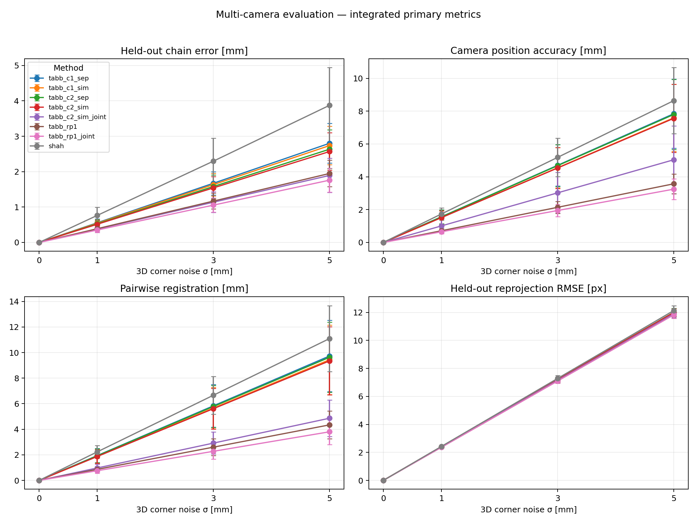
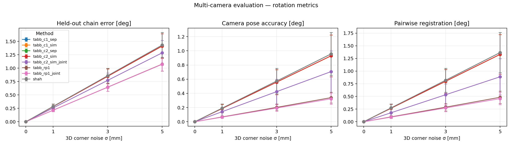

# Tabb & Ahmad Yousef (2017) Robot-World/Hand-Eye(s) 시뮬레이션 평가

## 1. 작업 범위

README 6.1의 **2단계 — Tabb & Ahmad Yousef (2017)** 를 공통 simulation/evaluation
protocol에서 실행한 결과다. 1단계 Shah(2013)와 기존 OpenCV 5개 방법
(Tsai/Park/Horaud/Andreff/Daniilidis)과 **동일한 trajectory, calibration/held-out
split, noise sample, random seed, 평가 코드**를 그대로 사용했다.

Tabb는 앞선 6개 방법과 달리 closed-form이 아니라 **cost function을 정의하고
Levenberg-Marquardt로 최소화하는 iterative 방법의 모음**이다. 논문이 제시하는
2개 cost function class × 3개 rotation parameterization × separable/simultaneous
조합과 multi-eye 확장을 모두 구현하고, 그중 어떤 요소가 어떤 지표를 얼마나
바꾸는지 단계별로 분리해 측정했다.

- 구현: `SOTA_Simulation/tabb_solver.py` (신규)
- 분해 실험: `SOTA_Simulation/tabb_shah_decomposition.py` (신규)
- OpenCV: 4.13.0 / SciPy: 1.15.2 / NumPy: 2.2.6 / Python: 3.10.20
- 실행일: 2026-09-20
- 실행 브랜치: `7-implement-Tabb`

논문:

- [A. Tabb and K. M. Ahmad Yousef, *Solving the robot-world hand-eye(s) calibration problem with iterative methods*, Machine Vision and Applications 28(5-6):569-590, 2017](https://doi.org/10.1007/s00138-017-0841-7)
- [arXiv 공개본 (erratum 포함)](https://arxiv.org/abs/1907.12425)
- [저자 구현 `amy-tabb/RWHEC-Tabb-AhmadYousef`](https://github.com/amy-tabb/RWHEC-Tabb-AhmadYousef)

> 저자 구현은 C++/Ceres 기반이라 이 저장소에 그대로 붙이지 않고, 논문 Eq. 5–17과
> Sec. 3.1의 초기화 규칙을 SciPy `least_squares`(MINPACK Levenberg-Marquardt)로
> 재구현했다. 재구현 근거와 원 구현과의 차이는 10절에 정리했다.

## 2. Tabb 방법 요약

### 2.1 푸는 식

Tabb는 robot-world/hand-eye 관계를 **`A_i X = Z B_i`** 로 쓴다 (논문 Eq. 2).

```text
A_i : world(= calibration board) -> camera   변환
B_i : robot base -> end-effector             변환
X   : robot base -> world                    (robot-world)
Z   : end-effector -> camera                 (hand-eye)
X~  := X^{-1}                                (c2/rp1/rp2가 실제로 추정하는 변수)
```

Shah의 `A X = Y B`와 같은 부류(미지수 2개)지만, Shah가 Kronecker product와 SVD로
닫힌 해를 구하는 반면 Tabb는 **무엇을 최소화할 것인지**를 바꿔가며 반복 최적화한다.
즉 이 논문의 기여는 새로운 대수적 해법이 아니라 **cost function 설계**다.

### 2.2 두 class의 cost function

**class 1 — pose-level** (A, B를 직접 사용)

| 이름 | 식 | 논문 |
| --- | --- | --- |
| `c1` | `Σ_i ‖A_i X − Z B_i‖²_F` | Eq. 5, 6 |
| `c2` | `Σ_i ‖A_i − Z B_i X~‖²_F` | Eq. 9, 10 |

두 cost 모두 **simultaneous**(회전·이동 동시 추정)와 **separable**(회전 먼저
Eq. 7/11 → 이동 나중 Eq. 8/12) 두 형태가 있다. separable의 이동 단계는 미지수에
대해 **선형**이므로 반복 없이 linear least squares로 정확해를 구했다.

**class 2 — pixel-level** (A를 쓰지 않고 corner 관측을 직접 사용)

| 이름 | 식 | 논문 |
| --- | --- | --- |
| `rp1` | `Σ_i Σ_j ‖x_ij − f(k, [Z B_i X~]_{3×4} X_j)‖²`, intrinsic `k` 고정 | Eq. 16 |
| `rp2` | `rp1` + intrinsic `k`까지 동시 추정 | Eq. 17 |

class 1은 "추정된 board pose(A_i)"를 입력으로 쓰므로 board 검출·카메라 보정
단계에서 생긴 오차가 그대로 전파된다. class 2는 A_i를 아예 쓰지 않고 corner
픽셀에서 직접 X, Z를 찾는다 — 이것이 두 class를 나눈 이유다(논문 Sec. 1.2).

### 2.3 rotation parameterization

Euler(x, y, z 순서 → `R = Rz·Ry·Rx`), axis-angle(Rodrigues), quaternion 세 가지를
모두 구현했다. 어떤 것을 쓰든 회전 행렬의 orthonormality가 자동으로 보장되므로
penalty term이 필요 없다는 것이 논문의 요지다.

### 2.4 초기값 (논문 Sec. 3.1)

```text
c1, c2 : R = I, t = 0
rp1    : c2 simultaneous 해
rp2    : rp1 해
```

논문 각주 2는 class 1이 초기값에 둔감하다고 보고한다. 본 재현에서도 identity
초기값에서 무잡음 ground truth를 `1e-13` 수준으로 복원했다(5.1절).

### 2.5 multi-eye (논문 Sec. 2.3, Eq. 19–23)

```text
A_{i,0} X = Z_0 B_i
A_{i,1} X = Z_1 B_i
...
A_{i,q-1} X = Z_{q-1} B_i
```

카메라 q대가 **X 하나를 공유**하고 Z_d만 따로 둔다. 카메라별 관측 수가 다르면
가중치 `w_d = min_e |S_e| / |S_d|`로 영향력을 같게 맞춘다(Eq. 23). 이 부분이
기존 6개 방법에는 전혀 없는 구조다 — Tsai/Park/Horaud/Andreff/Daniilidis/Shah는
모두 카메라마다 독립적으로 풀고 결과를 나중에 합친다.

> 본 시뮬레이션에서는 fixed camera 3대가 14개 event 전부에서 60개 corner를
> 모두 관측하므로 `w_d = 1.0`으로 균일하다. 가중치 기구는 구현되어 있으나
> 이 설정에서는 작동하지 않는다. camera dropout을 켜면 유효해진다.

## 3. 입력·출력과 transform convention

저장소 표기는 `T_destination_source`다. Tabb 논문의 `A_i`, `B_i` 정의를 이
저장소의 두 배치에 맞춰 옮기면 다음과 같다.

### Eye-in-hand wrist camera

board는 base frame에 고정, camera는 gripper에 고정.

```text
T_base_board
  = T_base_gripper(k)
  @ T_gripper_wrist         ← 주 출력 (다른 방법과 비교 가능)
  @ T_wrist_board(k)
```

| 논문 기호 | 이 저장소 값 |
| --- | --- |
| `A_i` | `T_wrist_board(k)` (다른 방법과 동일한 visual 입력) |
| `B_i` | `inverse(T_base_gripper(k))` — **반전** |
| `X` | `T_board_base`, `X~ = T_base_board` (추가 출력) |
| `Z` | `T_wrist_gripper`, 주 출력은 `Z^{-1} = T_gripper_wrist` |

### Eye-to-hand fixed camera

board는 gripper에 고정, camera는 base frame에 고정.

```text
T_base_gripper(k) @ T_gripper_board = T_base_fixed_i @ T_fixed_i_board(k)
```

| 논문 기호 | 이 저장소 값 |
| --- | --- |
| `A_i` | `T_fixed_i_board(k)` (visual 입력 그대로) |
| `B_i` | `T_base_gripper(k)` — **반전하지 않음** |
| `X` | `T_board_gripper`, `X~ = T_gripper_board` (추가 출력) |
| `Z` | `T_fixed_i_base`, 주 출력은 `Z^{-1} = T_base_fixed_i` |

논문은 "카메라가 end-effector에 달리고 board가 정지"한 배치만 다룬다. 이 저장소의
fixed camera는 그 반대 배치(board가 gripper에, camera가 정지)라서 base와
end-effector의 **역할이 서로 바뀐다**. 그래서 eye-to-hand에서는 robot pose를
반전하지 않는다.

### ⚠ 세 방법의 반전 규칙이 모두 다르다

| 방법 | 푸는 식 | eye-in-hand robot 입력 | eye-to-hand robot 입력 |
| --- | --- | --- | --- |
| Tsai/Park/Horaud/Andreff/Daniilidis | `AX = XB` | `T_base_gripper` 그대로 | **반전** |
| Shah (2013) | `AX = YB` | 그대로 | 그대로 |
| **Tabb (2017)** | `AX = ZB` | **반전** | 그대로 |

세 규칙이 전부 다르므로, 이 경로를 거치지 않고 solver를 직접 호출하는 코드를
새로 쓸 때는 반드시 zero-noise self test로 방향을 다시 확인해야 한다.

```bash
python -m SOTA_Simulation.tabb_solver   # 22개 조합 zero-noise 검증
```

## 4. 실험 설정

```text
Camera                 wrist 1 + fixed 3
Board corner           60 (11×7 ChArUco inner corner), 4대 모두 전 event 60개 관측
Pose                   14
Calibration pose       10: 0, 1, 3, 4, 6, 7, 8, 10, 11, 13
Held-out pose           4: 2, 5, 9, 12
3D corner noise [mm]    0, 1, 3, 5
Trials                 30
Seed                   2026…2055
```

기존 6개 방법과 동일한 조건이다. 재현 명령:

```powershell
conda activate sota-calibration-sim

# 본 실행: Tabb 사다리 7종 + Shah
python SOTA_Simulation/opencv_multicam_evaluation.py `
  --methods tabb_all shah `
  --noise-mm 0 1 3 5 --trials 30 --seed 2026 `
  --output examples/tabb_multicam_metrics

# ablation: rotation parameterization 3종 + rp2
python SOTA_Simulation/opencv_multicam_evaluation.py `
  --methods tabb_c2_sim tabb_c2_sim_euler tabb_c2_sim_quat tabb_rp1 tabb_rp2 `
  --noise-mm 0 1 3 5 --trials 30 --seed 2026 `
  --output examples/tabb_ablation_metrics

# Shah와의 차이 분해
python SOTA_Simulation/tabb_shah_decomposition.py --trials 30 `
  --output examples/tabb_multicam_metrics/shah_decomposition.json
```

실행되는 방법 이름:

| 이름 | 내용 |
| --- | --- |
| `tabb_c1_sep`, `tabb_c1_sim` | c1 separable / simultaneous |
| `tabb_c2_sep`, `tabb_c2_sim` | c2 separable / simultaneous |
| `tabb_c2_sim_joint` | c2 simultaneous + fixed camera 3대 multi-eye 결합 |
| `tabb_rp1`, `tabb_rp1_joint` | reprojection cost, 독립 / multi-eye 결합 |
| `tabb_rp2` | reprojection + intrinsic 동시 추정 (ablation 전용) |
| `tabb_c2_sim_euler`, `tabb_c2_sim_quat` | c2 simultaneous의 Euler / quaternion 판 (ablation 전용) |
| `tabb` | 대표 설정 = `tabb_c2_sim` |
| `tabb_all` | 사다리 7종(`c1_sep`, `c1_sim`, `c2_sep`, `c2_sim`, `c2_sim_joint`, `rp1`, `rp1_joint`)으로 펼침 |

> **대표 설정 고정 근거.** 논문 Sec. 5.5는 "reprojection cost를 쓰지 않는 조건에서
> 가장 좋은 `rrmse`/`rae`는 c2 simultaneous"라고 권고한다. rotation
> parameterization은 Sec. 5.2.3에서 "최신 solver를 쓰면 결과에 큰 영향이 없다"고
> 했고 본 재현에서도 그러했으므로(5.5절), Euler 특유의 wrap 문제가 없는
> axis-angle을 기본으로 고정했다. 따라서 `tabb` = **c2, simultaneous, axis-angle**.

## 5. 결과

값은 30 trials의 `mean ± sample standard deviation`이다.

### 5.1 무잡음 GT 복원

| 검증 | 결과 |
| --- | --- |
| solver 단독 (`python -m SOTA_Simulation.tabb_solver`) | 22개 조합 전부 `< 1e-12 mm` / `< 1e-13°` |
| 공통 evaluation runner, noise 0 | 사다리 7종 전부 translation `2.7e-07 … 2.2e-06 mm`, rotation `3.0e-08 … 1.8e-07°`, reprojection `6.9e-07 … 9.4e-07 px` |
| NaN / Inf | 960개 record(8 방법 × 4 noise × 30 trials) 전부 유한. `records.csv`의 `status` 열이 전부 `ok`이고 `report.json`의 `failure_count`도 모두 0이다 |

identity 초기값(`R = I`, `t = 0`)에서 시작해 c1/c2 네 조합 모두 수렴했다.
논문 각주 2의 "class 1은 초기값에 둔감하다"를 그대로 재현한 것이다.

### 5.2 cost function 사다리 — 무엇을 더하면 무엇이 좋아지는가

Shah(closed-form)에서 출발해 논문의 구성 요소를 하나씩 더해간 결과다.
값은 translation mean이며 화살표는 직전 단계 대비 변화다.

**1 mm noise**

| 단계 | 추가된 것 | Held-out | Camera pose | Registration | Reprojection |
| --- | --- | ---: | ---: | ---: | ---: |
| Shah (1단계) | — | 0.764 mm | 1.734 mm | 2.234 mm | 2.427 px |
| `tabb_c1_sep` | c1 + separable 반복 | 0.556 mm | 1.565 mm | 1.944 mm | 2.402 px |
| `tabb_c1_sim` | + 회전·이동 **동시** 추정 | 0.543 mm | 1.515 mm | 1.885 mm | 2.399 px |
| `tabb_c2_sep` | c2 + separable | 0.527 mm | 1.559 mm | 1.927 mm | 2.402 px |
| `tabb_c2_sim` | c2 + 동시 추정 | 0.514 mm | 1.512 mm | 1.871 mm | 2.399 px |
| `tabb_c2_sim_joint` | + **multi-eye 결합** | 0.379 mm | 1.007 mm | 0.973 mm | 2.382 px |
| `tabb_rp1` | + **pixel cost** (결합 없음) | 0.388 mm | 0.713 mm | 0.867 mm | 2.367 px |
| `tabb_rp1_joint` | pixel cost + multi-eye 결합 | **0.351 mm** | **0.648 mm** | **0.759 mm** | **2.365 px** |

**3 mm / 5 mm noise (translation mean)**

| 단계 | 3 mm Held-out | 3 mm Camera | 3 mm Reg | 5 mm Held-out | 5 mm Camera | 5 mm Reg |
| --- | ---: | ---: | ---: | ---: | ---: | ---: |
| Shah | 2.297 | 5.183 | 6.665 | 3.875 | 8.641 | 11.100 |
| `tabb_c1_sep` | 1.673 | 4.700 | 5.836 | 2.802 | 7.844 | 9.737 |
| `tabb_c1_sim` | 1.634 | 4.550 | 5.660 | 2.737 | 7.594 | 9.443 |
| `tabb_c2_sep` | 1.580 | 4.677 | 5.781 | 2.634 | 7.798 | 9.636 |
| `tabb_c2_sim` | 1.541 | 4.536 | 5.612 | 2.569 | 7.562 | 9.354 |
| `tabb_c2_sim_joint` | 1.136 | 3.022 | 2.919 | 1.893 | 5.037 | 4.865 |
| `tabb_rp1` | 1.168 | 2.140 | 2.601 | 1.949 | 3.573 | 4.345 |
| `tabb_rp1_joint` | **1.054** | **1.945** | **2.276** | **1.760** | **3.247** | **3.804** |

단계별 상대 변화(1/3/5 mm 평균):

| 전이 | Held-out | Camera pose | Registration | Reprojection |
| --- | ---: | ---: | ---: | ---: |
| Shah → `c1_sep` | **−27.4 %** | −9.4 % | −12.6 % | −1.1 % |
| `c1_sep` → `c1_sim` | −2.3 % | −3.2 % | −3.0 % | −0.1 % |
| `c1_sim` → `c2_sep` | −3.3 % | +2.8 % | +2.1 % | +0.1 % |
| `c2_sep` → `c2_sim` | −2.5 % | −3.0 % | −2.9 % | −0.1 % |
| `c2_sim` → `c2_sim_joint` | **−26.3 %** | **−33.4 %** | **−48.0 %** | −0.7 % |
| `c2_sim_joint` → `rp1` | +2.7 % | **−29.1 %** | −10.8 % | −0.6 % |
| `rp1` → `rp1_joint` | −9.7 % | −9.1 % | −12.5 % | −0.1 % |



Rotation 결과:



### 5.3 기존 6개 방법과의 비교

동일 trajectory·seed·split에서 나란히 둔 translation/reprojection mean이다.
OpenCV 5개 방법 값은 README 9절 표와 같은 실행에서 나온 값이다.

> **Reprojection 열은 intrinsic NPZ에 의존한다.** 이 지표만 `intrinsics/*.npz`를 쓰고
> 나머지 세 지표는 쓰지 않는다. `cam0.npz`가 갱신된 뒤로 예전 결과와 reprojection
> 값이 `0.1–0.4 %` 달라졌기 때문에, 이 표의 OpenCV 값과 `examples/*_multicam_metrics/`
> 전부를 현재 intrinsic으로 다시 생성해 맞췄다. Pose 계열 세 지표는 재생성 전후가
> trial 단위로 완전히 동일하다.

**1 mm noise**

| 방법 | Held-out | Camera pose | Registration | Reprojection |
| --- | ---: | ---: | ---: | ---: |
| **Tabb `rp1_joint`** | **0.35 mm** | **0.65 mm** | **0.76 mm** | **2.37 px** |
| Tabb `rp1` | 0.39 mm | 0.71 mm | 0.87 mm | 2.37 px |
| Tabb `c2_sim_joint` | 0.38 mm | 1.01 mm | 0.97 mm | 2.38 px |
| Tabb `c2_sim` (대표) | 0.51 mm | 1.51 mm | 1.87 mm | 2.40 px |
| Shah | 0.76 mm | 1.73 mm | 2.23 mm | 2.43 px |
| Park | 1.24 mm | 2.01 mm | 2.63 mm | 2.47 px |
| Horaud | 1.24 mm | 2.01 mm | 2.64 mm | 2.47 px |
| Tsai | 1.33 mm | 2.08 mm | 2.76 mm | 2.48 px |
| Andreff | 3.35 mm | 3.86 mm | 5.56 mm | 5.14 px |
| Daniilidis | 14.20 mm | 57.30 mm | 113.19 mm | 48.76 px |

**3 mm noise**

| 방법 | Held-out | Camera pose | Registration | Reprojection |
| --- | ---: | ---: | ---: | ---: |
| **Tabb `rp1_joint`** | **1.05 mm** | **1.94 mm** | **2.28 mm** | **7.10 px** |
| Tabb `rp1` | 1.17 mm | 2.14 mm | 2.60 mm | 7.10 px |
| Tabb `c2_sim_joint` | 1.14 mm | 3.02 mm | 2.92 mm | 7.15 px |
| Tabb `c2_sim` (대표) | 1.54 mm | 4.54 mm | 5.61 mm | 7.20 px |
| Shah | 2.30 mm | 5.18 mm | 6.66 mm | 7.28 px |
| Park | 3.71 mm | 6.03 mm | 7.91 mm | 7.40 px |
| Horaud | 3.71 mm | 6.03 mm | 7.92 mm | 7.40 px |
| Tsai | 4.31 mm | 6.40 mm | 8.87 mm | 7.51 px |
| Andreff | 20.00 mm | 21.27 mm | 32.56 mm | 36.90 px |
| Daniilidis | 15.56 mm | 60.53 mm | 116.83 mm | 51.10 px |

**5 mm noise**

| 방법 | Held-out | Camera pose | Registration | Reprojection |
| --- | ---: | ---: | ---: | ---: |
| **Tabb `rp1_joint`** | **1.76 mm** | **3.25 mm** | **3.80 mm** | **11.82 px** |
| Tabb `rp1` | 1.95 mm | 3.57 mm | 4.35 mm | 11.83 px |
| Tabb `c2_sim_joint` | 1.89 mm | 5.04 mm | 4.87 mm | 11.90 px |
| Tabb `c2_sim` (대표) | 2.57 mm | 7.56 mm | 9.35 mm | 11.99 px |
| Shah | 3.88 mm | 8.64 mm | 11.10 mm | 12.13 px |
| Park | 6.18 mm | 10.05 mm | 13.19 mm | 12.32 px |
| Horaud | 6.18 mm | 10.05 mm | 13.20 mm | 12.32 px |
| Tsai | 8.04 mm | 11.46 mm | 16.98 mm | 12.79 px |
| Andreff | 46.77 mm | 48.12 mm | 71.23 mm | 75.71 px |
| Daniilidis | 17.10 mm | 63.80 mm | 120.51 mm | 53.39 px |

Rotation error(1 mm / 5 mm, camera pose 기준):

| 방법 | 1 mm | 5 mm |
| --- | ---: | ---: |
| Tabb `rp1_joint` | **0.064°** | **0.323°** |
| Tabb `rp1` | 0.068° | 0.340° |
| Tabb `c2_sim_joint` | 0.141° | 0.707° |
| Tabb `c2_sim` | 0.186° | 0.930° |
| Shah / Tabb `c*_sep` | 0.191° | 0.956° |
| Park / Horaud | 0.190° / 0.191° | 0.951° / 0.956° |
| Tsai | 0.210° | 1.329° |
| Daniilidis | 21.98° | 22.72° |

> **위 표를 순위표로 읽지 않는다.** `rp1` 계열은 pose로 요약되기 전의 corner 60개를
> 각각 residual로 쓰므로 나머지 방법보다 **관측 정보를 더 많이 본다**. 같은 입력
> 조건에서 비교하려면 pose-level 입력만 쓰는 `tabb_c2_sim`(대표 설정) 행을 본다.
> 자세한 단서는 7절에 있다.

### 5.4 왜 좋아졌는가 — Shah와의 차이 분해

5.2의 **Shah → `c1_sep` 구간(−27.4 %)** 은 "iterative라서 좋아졌다"로 읽기 쉽지만
그렇지 않다. `tabb_shah_decomposition.py`로 카메라 종류별로 나눠보면 원인이
분명해진다 (30 trials, 1 mm noise):

| 방법 | wrist(eye-in-hand) translation | wrist rotation | fixed(eye-to-hand) translation | fixed rotation |
| --- | ---: | ---: | ---: | ---: |
| Shah | 1.6433 mm | 0.26004° | 1.7648 mm | 0.16807° |
| `tabb_c1_sep` | 0.9657 mm | 0.26004° | 1.7648 mm | 0.16807° |
| `tabb_c2_sep` | 0.9529 mm | 0.26004° | 1.7607 mm | 0.16807° |
| `tabb_c1_sim` | 0.9535 mm | 0.25620° | 1.7021 mm | 0.16192° |
| `tabb_c2_sim` | 0.9446 mm | 0.25744° | 1.7006 mm | 0.16202° |

전체 trial·noise에 걸친 Shah 대비 최대 편차:

| 비교 | rotation 최대 차 | translation 최대 차 |
| --- | ---: | ---: |
| `c1_sep` vs Shah, **fixed** | 9.4e-05° | **1.5e-03 mm** |
| `c1_sep` vs Shah, **wrist** | 6.9e-05° | 14.7 mm |
| `c1_sim` vs Shah, fixed | 7.8e-02° | 1.1 mm |

세 가지를 말해준다.

1. **separable의 회전 단계는 Shah와 같은 해다.** Eq. 7의 목적함수
   `Σ‖R_A R_X − R_Z R_B‖²_F` 는 Shah가 Kronecker product + SVD로 닫힌 형태로 푸는
   바로 그 문제다. 두 wrapper가 A/B를 서로 다르게 배정하지만, Frobenius norm은
   orthogonal 행렬을 좌우에서 곱하거나 transpose해도 변하지 않으므로 두 배정의
   회전 목적함수는 같은 식으로 정리된다. 실제로 회전 오차가 소수점 다섯 자리까지
   같고, 전체 trial·noise에 걸친 최대 편차가 `1e-04°` 미만이다.
   c1 separable과 c2 separable의 회전 단계도 서로 같은 문제다 —
   `‖R_A − R_Z R_B R_X~‖_F` 의 오른쪽에 `R_X`를 곱하면 정확히 c1 형태가 되고,
   실제 최대 편차도 `1.5e-05°`(wrist) / `4.7e-06°`(fixed)다
   (`shah_decomposition.json`의 `max_deviation_between_variants`).
2. **차이는 전적으로 이동 단계에서 나오고, 그것도 "어느 frame에서 residual을
   재는가"의 문제다.** Eq. 8/12의 linear least squares는 배치에 따라 residual이
   base frame에도, camera frame에도 놓일 수 있고 두 해는 다르다. fixed camera에서는
   이 저장소의 Shah wrapper와 Tabb wrapper가 **우연히 같은 배치**가 되어 결과가
   `1.5e-03 mm` 이내로 일치한다. 반대로 wrist camera에서는 두 배치가 서로 역이라
   결과가 갈리고, Tabb 쪽(camera frame)이 이 trajectory에서 41 % 더 정확하다.
3. **iterative가 실제로 새로 만드는 값은 `separable → simultaneous` 구간이다.**
   이 구간에서만 회전 추정 자체가 바뀐다(`0.26004° → 0.25620°`,
   `0.16807° → 0.16192°`). 이동 항이 회전 추정에 되먹임되기 때문이며,
   closed-form으로는 만들 수 없는 해다. 크기는 3 % 안팎으로 작다.

> **해석 시 주의.** Shah 대비 −27 %는 "Tabb 알고리즘이 더 좋다"가 아니라
> "eye-in-hand에서 이동 residual을 카메라 frame에서 재는 배치가 이 trajectory에서
> 더 잘 조건화되어 있다"로 읽어야 한다. 이는 논문 Sec. 5.4가 지적한
> "일부 방법은 이동 성분의 스케일과 분포에 민감하다"와 같은 종류의 현상이다.

그렇다면 Tabb 고유의 기여로 돌릴 수 있는 것은 다음 세 가지다.

| 기여 | 해당 전이 | 가장 크게 바뀐 지표 |
| --- | --- | --- |
| simultaneous 정식화 | `sep → sim` | camera pose −3.0 %, rotation −1.5 % |
| **multi-eye 결합 (Sec. 2.3)** | `c2_sim → c2_sim_joint` | **registration −48.0 %**, camera pose −33.4 % |
| **pixel cost (class 2)** | `c2_sim_joint → rp1` | **camera pose −29.1 %**, rotation −52 % |

- **multi-eye 결합이 registration을 절반으로 줄인다.** 당연한 결과다. 기존 6개
  방법은 카메라마다 독립으로 풀기 때문에 카메라 사이를 묶는 제약이 전혀 없고,
  `T_gripper_board`가 카메라마다 따로 추정된다. joint 버전은 물리적으로 하나여야
  하는 그 값을 하나의 변수로 두므로, 카메라 간 상대 자세(= registration)가 직접
  제약된다. **이 저장소의 4-camera rig에서 Tabb를 쓸 이유가 있다면 이것이다.**
- **pixel cost는 camera pose와 rotation을 크게 개선한다.** 다만 held-out chain은
  오히려 +2.7 % 나빠진다. 두 지표가 서로 다른 것을 재기 때문이다 — rp1은 카메라
  자세를 정확히 맞추는 대신, pose로 요약된 board 관측과의 일관성은 직접
  최적화하지 않는다.
- **reprojection RMSE는 어떤 단계에서도 거의 변하지 않는다** (2.427 → 2.365 px,
  −2.6 %). 이 지표는 held-out corner의 3D noise가 그대로 픽셀로 투영된 값이
  지배적이어서, extrinsic을 아무리 잘 맞춰도 내려갈 수 있는 바닥이 정해져 있다.
  **reprojection error만 보고 extrinsic 품질을 판단하면 안 된다**는 README 8.4의
  경고가 숫자로 확인된 셈이다: Shah와 `rp1_joint`의 reprojection 차이는 2.6 %인데
  camera pose 차이는 63 %다.

### 5.5 rotation parameterization ablation

`c2 simultaneous`를 Euler / axis-angle / quaternion으로 바꿔 각각 30 trials 실행했다.

| noise | 세 parameterization의 최대 상대 편차 |
| ---: | ---: |
| 1 mm | 4.2e-06 |
| 3 mm | 1.9e-06 |
| 5 mm | 1.4e-06 |

7개 지표 어디에서도 상대 차이가 `1e-04`을 넘지 않는다.

> 이 표의 자릿수까지 재현되지는 않는다. `least_squares`가 도는 BLAS의 thread 수에
> 따라 수렴점이 `1e-16` 수준에서 흔들리고, 조건이 나쁜 trial에서 LM이 이를
> `1e-05 mm` 정도까지 키우기 때문이다. 결론(`1e-04` 미만, 즉 parameterization
> 무관)은 재실행해도 유지되지만 표의 값 자체는 실행마다 조금씩 달라진다.
> Pose 계열 지표와 closed-form 방법(Shah, OpenCV 5종)은 trial 단위로 완전히
> 재현된다. 논문 Sec. 5.2.3의
"최신 solver를 쓰면 rotation representation 선택이 결과에 큰 영향을 주지 않는다"를
그대로 재현했다. 논문이 Dataset 1에서 관찰한 Euler c1 simultaneous의 이상치
(`rrmse` 12.13 px vs 다른 둘 3.63 px)는 본 trajectory에서는 재현되지 않았다.

### 5.6 `rp2`는 이 시뮬레이션에서 쓰면 안 된다

`rp2`(intrinsic 동시 추정)는 사다리에서 제외하고 ablation으로만 돌렸다.

| noise | `rp1` held-out / rotation / reprojection | `rp2` held-out / rotation / reprojection |
| ---: | ---: | ---: |
| 0 mm | 0.000 mm / 0.000° / 0.000 px | 0.000 mm / 0.000° / 0.000 px |
| 1 mm | 0.388 mm / 0.215° / 2.367 px | 7.984 mm / 0.671° / 6.785 px |
| 3 mm | 1.168 mm / 0.644° / 7.101 px | 25.809 mm / 2.167° / 21.861 px |
| 5 mm | 1.949 mm / 1.075° / 11.831 px | 41.819 mm / 3.499° / 35.410 px |

무잡음에서는 `rp2`도 GT를 복원하지만, noise가 들어가는 순간 held-out 오차가
`rp1`의 20배가 된다. 이유는 분명하다. **이 시뮬레이션의 intrinsic은 정의상
정확하다.** `project_points`가 생성과 평가에 같은 `K`, `D`를 쓰므로 intrinsic에
복원할 오차가 없고, 카메라당 8개의 추가 자유도는 3D corner noise를 흡수하는 데만
쓰인다. 초점거리와 깊이 방향 이동이 맞바꿔지는 전형적 축퇴다.

이는 논문 Table 10/11의 거동과 같은 방향이다. 논문 Dataset 1에서도 `rp2`는
`rrmse`를 1.569 → 1.363 px로 약간 낮추는 대신 `e_R2`를 0.385° → 5.683°,
`e_t`를 338.8 → 6233.3으로 악화시킨다. 논문 Sec. 5.5는 `rp2`를 "intrinsic
calibration 품질이 나쁠 때" 쓰라고 명시한다 — 본 시뮬레이션은 정반대 조건이다.

> **실데이터에서는 다시 검토해야 한다.** 실제 촬영에서는 intrinsic에 진짜 오차가
> 있으므로 `rp2`가 도움이 될 수 있다. 다만 그때도 held-out 지표로 과적합 여부를
> 반드시 확인해야 한다.

### 5.7 그 밖의 확인

- **noise에 대해 정확히 선형.** Tabb 7종 전부 1 mm 대비 배율이 3 mm에서
  `3.00–3.01×`, 5 mm에서 `5.00–5.04×`다. Shah도 `2.98–3.01×`, `4.97–5.07×`로
  같다. 반면 Tsai는 `3.03–3.23×` / `5.16–6.16×`, Andreff는 `5.51–7.18×` /
  `12.46–14.73×`로 초선형이고, Daniilidis는 이미 1 mm에서 망가져 있어 배율이
  `1.03–1.20×`로 평평하다.
- **trial 간 변동이 작아진다.** 변동계수(std/mean, held-out 기준)가 Shah
  `0.275–0.296`에서 Tabb 사다리 전반 `0.190–0.208`로 내려간다. `rp1` 계열이
  `0.190–0.191`로 가장 낮다 — corner 단위 residual을 쓰므로 trial마다 해가 흔들리는
  폭이 가장 작다. 예외는 `c2_sim_joint`(`0.255–0.257`)인데, std가 커진 것이 아니라
  평균이 더 크게 줄어들어 생긴 비율 상승이다(std 자체는 0.098 → 1 mm 기준으로
  `c2_sim` 0.106보다 작다).
- **method 목록에 무관하게 재현된다.** `tabb_c2_sim`과 `tabb_rp1`을 본 실행과
  ablation 실행 두 곳에서 각각 돌렸고, 7개 지표 × 4 noise 전부
  `max|차이| = 0.000e+00`이었다. noise sample이 trial 단위로 먼저 뽑히고 method
  loop가 그 뒤에 돌기 때문이다.

## 6. 평가 지표

README 8절과 동일하다.

- **Held-out chain error:** held-out board observation을 추정 extrinsic으로 base
  frame에 옮겨 GT board pose와 비교한 translation/rotation error.
- **Camera pose accuracy:** wrist와 fixed camera 3대의 extrinsic을 GT와 비교한
  equal-camera macro error.
- **Multi-camera registration consistency:** 네 camera의 6개 pairwise relative
  transform을 GT와 비교한 평균 error.
- **Held-out reprojection RMSE:** held-out board corner를 robot pose와 추정
  extrinsic으로 예측해 noisy held-out observation과 비교한 pixel RMSE.

## 7. 7개 방법이 "어떻게" 다른가

| 방법 | 푸는 식 | 미지수 | 해법 | 회전·이동 | 카메라 간 결합 | solver 입력 |
| --- | --- | :-: | --- | --- | --- | --- |
| Tsai–Lenz | `AX = XB` | 1 | closed-form | separable | 없음 | 상대 pose |
| Park–Martin | `AX = XB` | 1 | closed-form (Lie group) | separable | 없음 | 상대 pose |
| Horaud–Dornaika | `AX = XB` | 1 | closed-form (quaternion) | separable | 없음 | 상대 pose |
| Andreff | `AX = XB` | 1 | closed-form (Kronecker, 선형) | simultaneous | 없음 | 상대 pose |
| Daniilidis | `AX = XB` | 1 | closed-form (dual quaternion, SVD) | simultaneous | 없음 | 상대 pose |
| Shah (2013) | `AX = YB` | 2 | closed-form (Kronecker + SVD) | separable | 없음 | **절대 pose** |
| **Tabb c1/c2 sep** | `AX = ZB` | 2 | **iterative (LM)** | separable | 없음 / **joint 가능** | 절대 pose |
| **Tabb c1/c2 sim** | `AX = ZB` | 2 | **iterative (LM)** | **simultaneous** | 없음 / **joint 가능** | 절대 pose |
| **Tabb rp1/rp2** | `AX = ZB` | 2 | **iterative (LM)** | simultaneous | 없음 / **joint 가능** | **pixel corner** |

핵심 축은 네 개다.

1. **미지수 1개(AX=XB) vs 2개(AX=YB, AX=ZB).** 전자는 연속 포즈 간 *상대* 운동을
   쓰고, 후자는 각 포즈의 *절대* 관측을 쓴다. 절대 pose를 쓰면 robot pose 오차에
   더 직접 노출되지만(8절), 무잡음 robot pose를 주는 본 시뮬레이션에서는 유리하다.
   1 mm에서 Shah 0.76 mm vs Park 1.24 mm의 차이가 이 축에서 나온다.
2. **closed-form vs iterative.** Tabb만 iterative다. 다만 5.4에서 보았듯 iterative
   자체의 이득은 `sep → sim`의 3 % 수준으로 작다. iterative의 진짜 값어치는
   "닫힌 해가 존재하지 않는 목적함수(pixel cost, multi-eye 결합)를 쓸 수 있게
   된다"는 점이다.
3. **카메라 간 결합 유무.** Tabb만 여러 카메라를 하나의 최적화에 묶을 수 있다.
   본 rig에서 registration을 48 % 줄인 유일한 요인이다.
4. **solver 입력이 pose인가 pixel인가.** Tabb class 2만 corner 픽셀을 직접 쓴다.
   camera pose 정확도를 가장 크게 개선하지만, **다른 방법보다 더 많은 정보를
   본다**는 점을 분리해서 읽어야 한다(아래).

> **공정성 단서.** `rp1`/`rp2`는 포즈로 요약되기 전의 corner 60개를 각각 residual로
> 쓰므로, pose 하나로 압축된 입력만 받는 나머지 방법보다 정보량이 많다. 다만
> 관측의 원천은 같다 — 같은 noisy 3D corner를 같은 카메라 모델로 투영한 것이며,
> trajectory·noise sample·seed·held-out split이 모두 동일하다. 따라서 `rp1`의
> 우위는 "더 나은 추정기"가 아니라 "관측을 압축하지 않고 쓴 결과"로 읽는 것이
> 정확하다. pose-level 입력만으로 비교하려면 `tabb_c2_sim`(대표 설정) 행을 본다.

## 8. 실제 데이터 적용을 위한 입력

### 공통 필수 데이터 (Shah와 동일)

- 시간이 맞는 event별 robot FK `T_base_gripper`
- camera별 RGB image 또는 이미 검출된 board corner
- board의 3D corner geometry
- camera별 intrinsic matrix `K` 및 distortion coefficient `D`
- PnP로 계산한 event/camera별 `T_camera_board`
- `event_id`, camera ID, robot pose–image timestamp 매칭
- translation 단위와 robot pose convention(flange/TCP/tool frame) 명세
- calibration event와 held-out event의 고정 split

### Tabb 고유 추가 요건

- **`rp1`/`rp2`를 쓰려면 corner 픽셀 좌표 자체가 필요하다.** PnP 결과
  `T_camera_board`만으로는 class 2를 돌릴 수 없다. 저장 시
  `(event_id, camera_id, corner_id, u, v)` 테이블을 함께 남겨야 한다.
  class 1(`c1`/`c2`)만 쓸 거면 Shah와 같은 입력으로 충분하다.
- **multi-eye 결합을 쓰려면 카메라들이 공유하는 변환이 무엇인지 확정해야 한다.**
  이 저장소 구조에서는 fixed camera 3대가 `T_gripper_board`를 공유하므로 결합
  가능하지만, wrist camera는 공유 대상이 다르므로(`T_base_board`) 같은 X에 묶을 수
  없다. 실데이터에서도 이 구분을 먼저 확인해야 한다.
- **카메라별 관측 수가 다르면 Eq. 23 가중치가 실제로 작동한다.** 본 시뮬레이션은
  4대 전부 14 event × 60 corner를 모두 보므로 `w_d = 1.0`이지만, 실촬영에서는
  카메라마다 board가 안 보이는 event가 생긴다. 이때 가중치를 끄면 관측이 많은
  카메라가 X를 지배한다.
- **절대 pose를 그대로 쓰므로 robot pose 오차에 직접 노출된다.** Shah와 동일한
  주의사항이다. 본 시뮬레이션이 robot pose를 무잡음으로 주는 조건임을 감안하면,
  실데이터에서는 Shah·Tabb의 우위가 그대로 유지된다고 가정할 수 없다. FK 정확도와
  robot–camera 동기화 정밀도를 먼저 확보해야 한다.
- **초기값은 identity로 충분하지만, `rp1`은 다르다.** class 1은 초기값에 둔감함을
  확인했으나(5.1절), class 2는 논문 Sec. 2.2가 명시하듯 초기값에 민감하다.
  반드시 `c2` simultaneous 해를 초기값으로 넣어야 한다 (구현이 자동으로 한다).
- **`rp2`는 intrinsic 품질이 나쁠 때만.** 5.6절 참고. 쓰더라도 held-out 지표로
  과적합을 확인한다.
- **포즈 다양성.** Shah와 마찬가지로 회전축이 다양한 10 포즈 이상을 권장한다.
  한 축만 반복 회전시키는 trajectory는 피한다.

### 촬영 구성 및 전처리

- Eye-in-hand: workspace에 정지한 board를 wrist camera가 다양한 robot pose에서 관측.
- Eye-to-hand: gripper와 관계가 고정된 board를 움직이며 fixed camera가 관측.
- Intrinsic/distortion을 고정하고 corner 검출, positive depth, PnP reprojection
  error를 검사.
- Robot pose와 image를 같은 event로 synchronization하고 robot pose를 하나의
  canonical physical frame으로 정규화.
- PnP 출력을 `T_camera_board`, translation을 metre로 통일.
- **Eye-in-hand에서 `T_base_gripper`를 반전해 Tabb solver에 전달** (3절 표 참고 —
  Shah 및 Tsai 계열과 규칙이 다르다).
- Calibration/held-out split을 solver 실행 전에 고정하고 held-out event를
  fitting에서 제외.

독립적인 물리 GT가 없는 실제 데이터에서는 held-out reprojection과 camera 간
consistency는 평가할 수 있지만 절대 camera pose accuracy는 주장할 수 없다.
절대 성능을 비교하려면 calibration에 사용하지 않은 정밀 jig, tracker, motion
capture 또는 독립 6-DoF GT가 필요하다.

## 9. 결과 파일

```text
examples/tabb_multicam_metrics/
├── report.json                      # 실험 설정, seed/trials, provenance, noise별 mean/std (8 방법)
├── records.csv                      # 8 방법 × 4 noise × 30 trials = 960 record
├── figure1_integrated_metrics.png   # primary metric
├── figure2_rotation_metrics.png     # rotation metric
└── shah_decomposition.json          # 5.4절 분해 실험 원시 결과

examples/tabb_ablation_metrics/
├── report.json                      # 5.5 / 5.6절 (rotation parameterization, rp2)
├── records.csv                      # 5 방법 × 4 noise × 30 trials = 600 record
├── figure1_integrated_metrics.png
└── figure2_rotation_metrics.png
```

`records.csv`는 통합 지표 외에 `wrist_*`, `cam0_*`, `cam1_*`, `cam3_*` 접두사로
camera별 지표를 함께 담는다(README 8.2). Registration은 camera pair 지표라 camera
하나로 분해되지 않으므로 통합 값만 있다. `status` 열은 `ok` / `nonfinite` /
`solver_error:<type>` 중 하나이며, 실패한 trial도 지우지 않고 NaN으로 남긴다
(README 11-7). `report.json`의 `provenance`에는 저장소 commit hash와
Python/NumPy/SciPy/OpenCV 버전이 들어간다(README 11-10).

`shah_decomposition.json`은 `max_deviation_from_shah`(Shah 대비)와
`max_deviation_between_variants`(c1 ↔ c2)를 모두 저장한다 — 5.4절의 두 주장이
각각 어느 숫자에서 나왔는지 대조할 수 있다.

## 10. 추가·변경된 코드

| 파일 | 변경 |
| --- | --- |
| `SOTA_Simulation/tabb_solver.py` | 신규. AX=ZB iterative solver (c1/c2 × sep/sim × 3 parameterization, rp1/rp2, multi-eye), zero-noise `self_test()` |
| `SOTA_Simulation/tabb_shah_decomposition.py` | 신규. Shah와의 차이를 카메라 종류별로 분해 (5.4절) |
| `SOTA_Simulation/opencv_multicam_evaluation.py` | `TABB_METHODS` registry와 dispatch 분기 추가, rp1/rp2용 2D 관측 생성기 `build_pixel_observations()` 추가, `--methods` 파싱 정리(알 수 없는 이름이 조용히 통과하던 문제 수정, `tabb_all` 확장 추가), 범례 제목을 `Method`로 변경. README 규칙 보완: camera별 지표 열(11-9), 실패 trial `status` 기록과 `failure_count`(11-7), `seed`/`trials`/`provenance` 기록(11-10) |
| `tests/test_tabb_solver.py` | 신규. self test + 조합별 zero-noise 복원 + runner 통합 검증 18개 |
| `tests/test_evaluation_records.py` | 신규. camera별 열, 실패 trial 기록, provenance 기록 검증 3개 |
| `README.md` | 6.1/6.2/10절에 Tabb 실행 방법과 결과 문서 링크 추가 |
| `SOTA_Simulation/shah_solver.py` | 변경 없음 |
| `SOTA_Simulation/tsai_combined_demo.py`, `methods.py` | 변경 없음 |

`--methods all`은 여전히 기존 5개 OpenCV 방법만 실행한다. Shah/Tabb는 이름을
명시해야 실행되며, 이는 기존 결과 재현성을 깨지 않기 위한 의도적 선택이다.

### 원 구현과의 차이

저자 구현은 C++/Ceres이고 본 재현은 Python/SciPy다. 다음을 맞췄다.

- cost function: 논문 Eq. 5–17 그대로
- 초기값: 논문 Sec. 3.1 그대로 (`c1`/`c2` ← identity, `rp1` ← `c2` sim, `rp2` ← `rp1`)
- rotation parameterization: Euler(`R = Rz·Ry·Rx`), axis-angle, quaternion 3종
- multi-eye 가중치: Eq. 23의 `w_d = min_e|S_e| / |S_d|`
- 최적화기: Ceres LM 대신 SciPy `least_squares(method="lm")` (MINPACK LM).
  Jacobian은 두 구현 모두 수치 미분/자동 미분으로 얻는다.

다음은 맞추지 않았다.

- separable의 이동 단계(Eq. 8/12)를 반복 최적화 대신 linear least squares로 정확히
  풀었다. 해당 문제는 미지수에 대해 선형이므로 이쪽이 논문 목적함수의 정확한
  최소점이다.
- `rp2`의 intrinsic 파라미터는 `[fx, fy, cx, cy, k1, k2, p1, p2]` 8개만 둔다
  (논문은 12개). 본 시뮬레이션의 투영 모델이 5-parameter이기 때문이며, 어차피
  5.6절 이유로 사다리에서 제외한 ablation 전용이다.
- 저자 저장소의 C++ 예제 데이터셋은 빌드·재현하지 않았다. 대신 논문 Eq. 5–17을
  직접 구현하고 22개 조합 전부에 대해 무잡음 복원을 검증했으며(5.1절), 논문의
  정성적 결론 두 가지 — rotation parameterization 무관성(Sec. 5.2.3)과 `rp2`의
  pose 정확도 악화(Table 10/11) — 를 독립적으로 재현했다.
